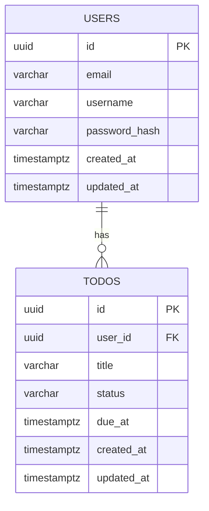

# データモデル

```mermaid
erDiagram
    USERS ||--o{ TODOS : has

    USERS {
        uuid id PK
        varchar email
        varchar username
        varchar password_hash
        timestamptz created_at
        timestamptz updated_at
    }

    TODOS {
        uuid id PK
        uuid user_id FK
        varchar title
        varchar status
        timestamptz due_at
        timestamptz created_at
        timestamptz updated_at
    }
```

補足:
- nullable: `todos.due_at`
- `status` は enum 想定（例: `todo|doing|done`）
- unique: `users.email`
